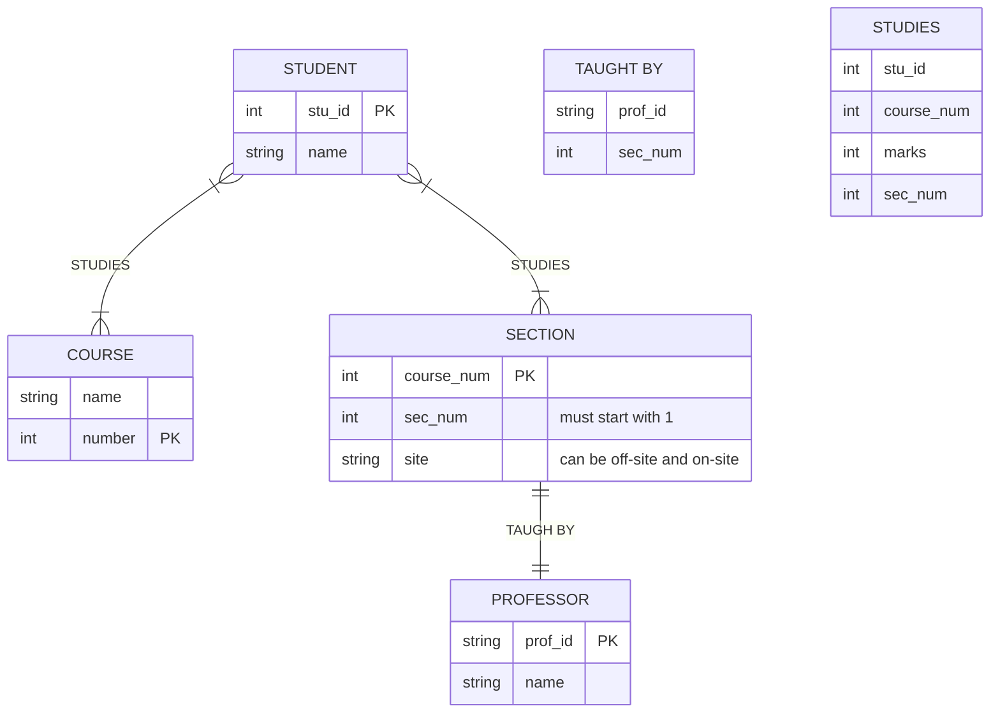

# Course Q3 2023
Consider the following situation:
- One or more sections of a course are offered cach tern. Courses have names and numbers. In cach term, the sections of cach course are numbered starting with 1.
- Most course sections are taught on-site, but a few are taught at off-site locations.
- Students have student numbers and names.
- Each course section is taught by a professor. A professor may teach more than one section in a term, but if a professor teaches more than one section in a term, they are always sections of the same course. Some professors do not teach every term.
- A student receives a mark for cach course in which they are enrolled. Each student has a cumulative grade point average (GPA) which is calculated from all course marks the student has received.

## Report
List the marks of the students for a specific course (say DBMS) that contains Student details with marks in that course and CGPA. The list should be sorted according to Section number (say A, B.).

## ER Diagram
