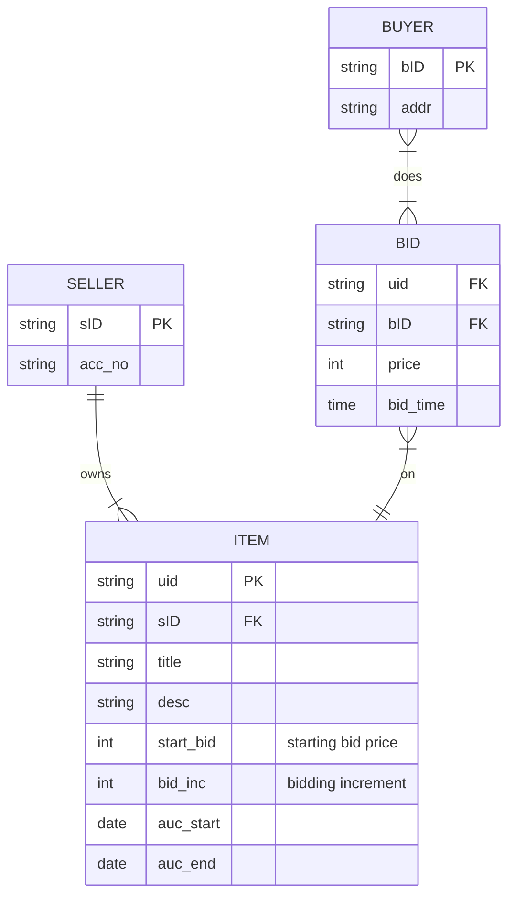

# ONLINE AUCTION Q4 2023
Consider an ONLINE_AUCTION database system in which members (buyers and sellers) participate in the sale of items. A buyer has a shipping address and a seller has a bank account number recorded in the database. Items are placed by a seller for sale and are identified by a unique item number assigned by the system. Items are also described by an item title, a description, starting bid price, bidding increment, the start date of the auction, and the end date of the auction. Buyers make bids for items they are interested in.Bidprice and time ofbid is recorded. The bidder at the end of the auction with the highest bid price is declared the winner and a transaction between buyer and seller may then proceed.

## Report
A monthly report on auction items with the buyer details and sale price.

## ER Diagram
