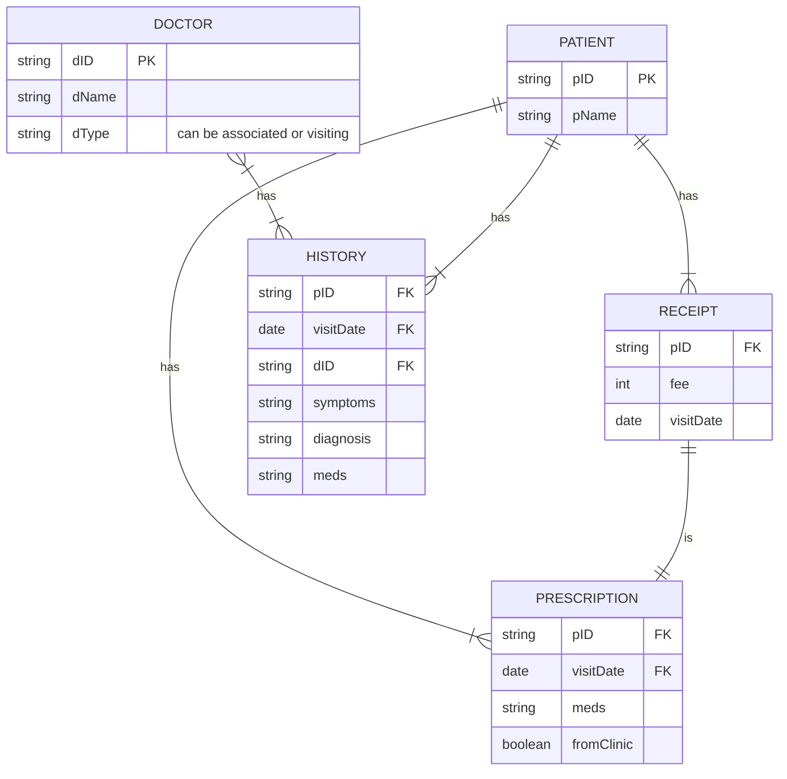

# Clinic Management

## ERD

```mermaid
erDiagram
    PATIENT {
        string pID PK
        string pName
    }
    DOCTOR {
        string dID PK
        string dName
        string dType "can be associated or visiting"
    }
    RECEIPT {
        string pID FK
        int fee
        date visitDate
    }
    HISTORY {
        string pID FK
        date visitDate FK
        string dID FK
        string symptoms
        string diagnosis
        string meds
    }
    PRESCRIPTION {
        string pID FK
        date visitDate FK
        string meds
        boolean fromClinic
    }
    PATIENT one to one or more RECEIPT : has
    DOCTOR one or more to one or more HISTORY : has
    PATIENT one to one or more PRESCRIPTION : has
    PATIENT one to one or more HISTORY : has
    RECEIPT one to one PRESCRIPTION : is
```
