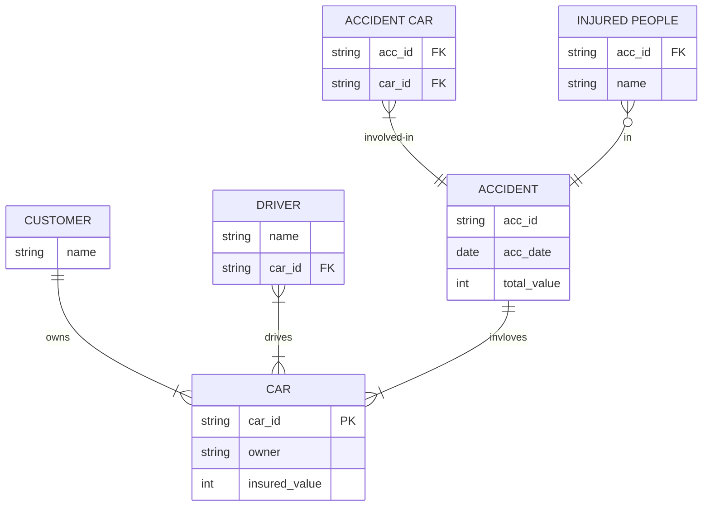

# Car insurance Q2 2023
Consider a database for Car insurance company. The company maintains car insurance database that includes detailed data about customers (car owners), cars, accidents, drivers involved in accidents and injured drivers and/or passengers, Note that any customer can insure nany cars, cach car may have different drivers at different times, and accidents typically involve one or more cars

## Report
List the accident cases between a given timc interval; the report nust contain all details like Date of Accident, Involved Car(s), Car Owner's name, Insured Value, Injured person (if any).

## ER Diagram
