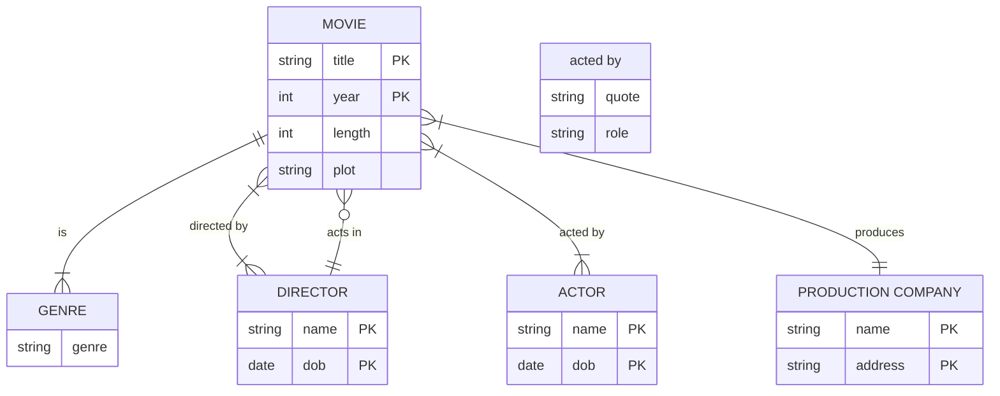

# Movie assignment
Consider a MOVIE database in which data is recorded about the movie industry. The data requirements are summarized as follows:
- Each movie is identified by title and year of release. Each movie has a length in minutes. Each has a production company, and each is classified under one or more genres (such as horror, action, drama, and so forth). Each movie has one or more directors and one or more actors appear in it. Each movie also has a plot outline. Finally, each movie has zero or more quotable quotes, each of which is spoken by a particular actor appearing in the movie.
- Actors are identified by name and date of birth and appear in one or more movies. Each actor has a role in the movie.
- Directors are also identified by name and date of birth and direct one or more movies. It is possible for a director to act in a movie (including one that he or she may also direct).
- Production companies are identified by name and each has an address. A production company produces one or more movies.

## Reports to generate
- REPORT 1: Details of movies released within a Specified Time are sorted by Released Date and Genre.
- REPORT 2: Details of movies produced by a given Production Company are sorted by Genre and Director.

## ER diagram
