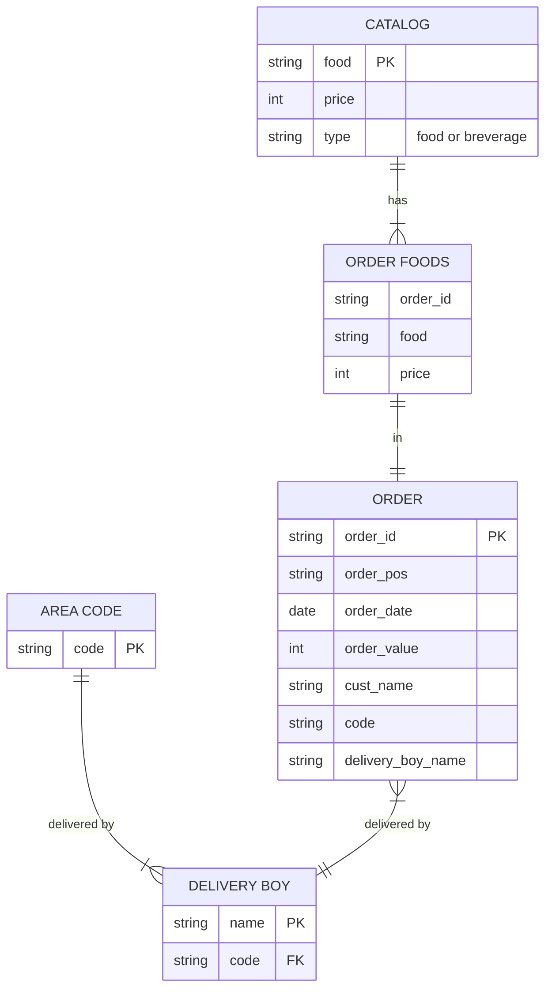

# Restaurant, Q1 2023
A restaurant maintains catalog for the list of food and beverage items that it provides. To provide food facility at the premises of the customers, the restaurant takes order online through the system. Orders on phone are also entertained. To deliver the deliveries we have delivery boys. Each delivery boy is assigned a specific area code. The delivery boy cannot deliver outside the area to which he is assigned. 

## Report 
Delivered order details within a specifie area. The report should contain the attributes Date, Customer name, Food(s). Order value, Delivery Boy. The report should be sorted in terms of date.

## ER diagram

<i>ORDER FOODS has total participation in "has" relation to CATALOG but CATALOG has partial paricipation to the same relation.</i>